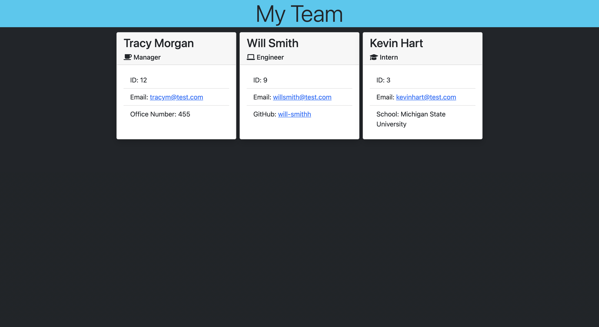
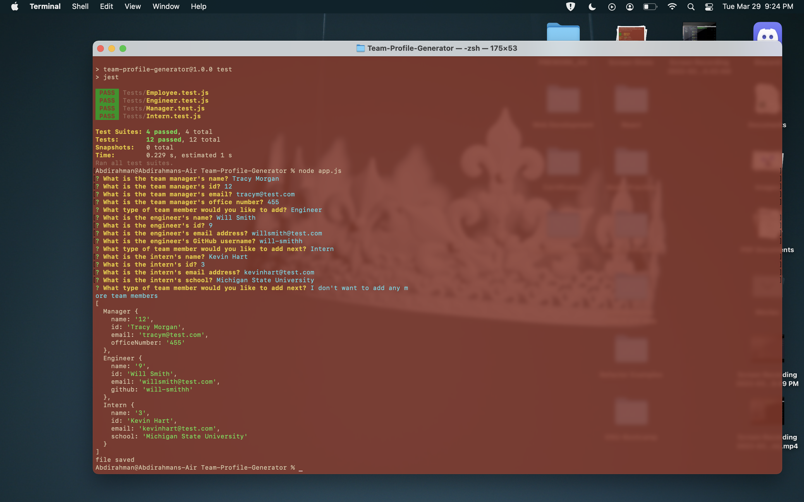

# Team-Profile-Generator

  ## Table of contents:
 * [Description](#description)
 * [Installation](#installation)
 * [Usage](#usage)
 * [Contributors](#contributors)
 * [Test](#test)
 * [Questions](#questions)
  ### Description:
  This is a Node.js command-line application that takes in information about employees on a software engineering team, then generates an HTML webpage that displays summaries for each person.
  
  Screenshots of running program:  
  
  ### Installation:
  To run this program the only thing you need is node package manager! Run 'npm i' in the command line to install all the necessary dependencies. The application can be invoked by the command: "node app.js" in your terminal or gitbash.
  ### Usage:
  After running the command "node app.js" a series of questions will appear. After you choose your employees and fill out their profiles an html page is generated in the dist/index.html file.
  ### License:
  This project is licensed under: MIT
  ### Contributors:
  Abdirahman
  ### Test:
  To test, run the following command: run 'npm test' in your terminal or gitbash in the directory that holds my project! you would have to clone it into your       local computer first!

  ### Questions:
  If you have any questions contact Abdirahman on [Github](https://github.com/aden-abdirahman)
  or [Email](https://aden.abdirahman45@gmail.com)
  
  Link to video walkthrough:  https://drive.google.com/file/d/1QQfrXAWq_B3dqKQLaStCZkdwjXvQS1aq/view?usp=sharing
